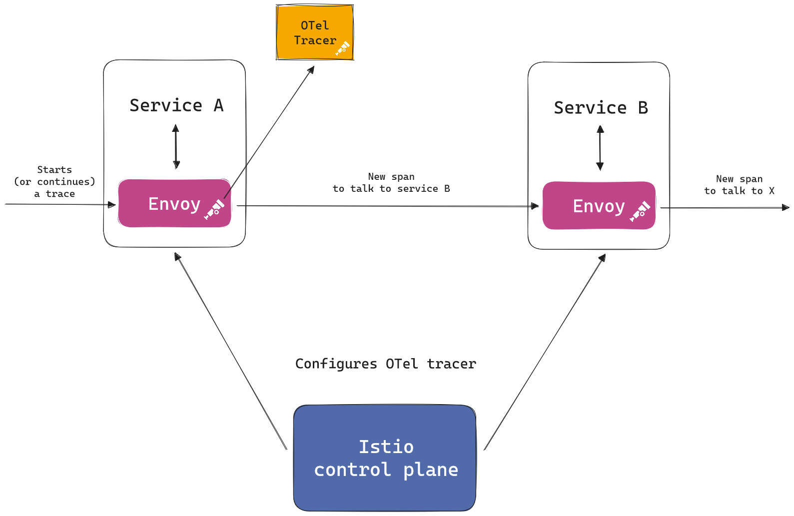
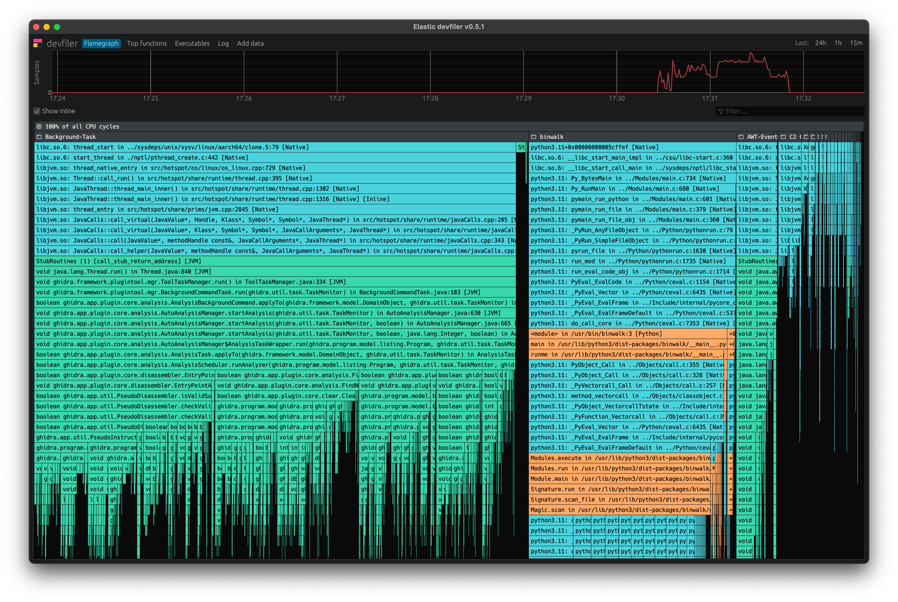
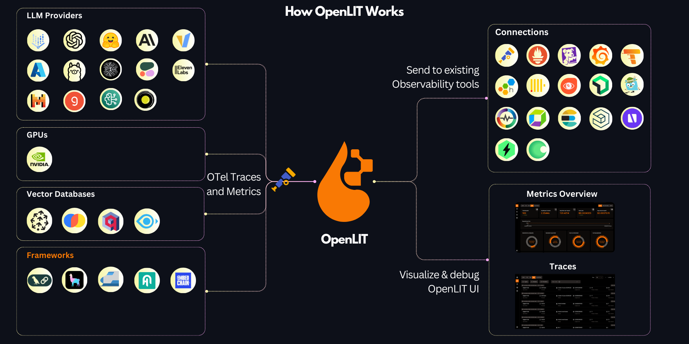

<!--
theme: rose-pine-moon
style: |
    /*
    * @theme enable-all-auto-scaling
    * @auto-scaling true
    */
    /* @theme marpit-theme */
    section {
      font-size: 30px;
      padding: 50px;
    }
    section.lead h2 {
      font-size: 30px;
      text-align: center;
    }
    section.lead h2 {
      font-size: 30px;
      text-align: center;
      color: var(--pine);
    }
    img[alt~="center"] {
        display: block;
        margin: 0 auto;
    }
    h3, h4, h5, h6 {
        color: skyblue;
    }
headingDivider: 2 
paginate: false
-->


# OpenTelemetry Journey

2024.09
Jinwoong Kim

## Who am I?
- Jinwoong Kim

- Cloud Architect

- Speaker, Translator

- @ddiiwoong

## Unknown/Unknown

https://youtu.be/REWeBzGuzCc?si=Gj4DTQLTTledvv_o

> “우리가 아는 것에는 네 가지가 있습니다.
첫째, 안다는 것을 알고 있는 것 (Known knowns)
둘째, 모르고 있다는 것을 아는 것 (Known unknowns)
셋째, 모르고 있다는 사실조차 모르는 것 (*Unknown unknowns*)
그리고 또 하나, 안다는 사실을 모르는 것이 있죠. (Unknown knowns)
다시 말해, 안다고 생각하지만 사실은 몰랐던 것입니다.“


## Observability Introduction

### A *system* is `observable` if you can determine the *behavior* of the system based on its *outputs*.


## Observability

#### Logs - Lines of text
```hikari-pool-1 - Connection is not available, request timed out after 30000ms```

#### Metrics - Time-orderd set of data
```hikaricp_connections_timeout_total{pool="HikariPool-1",} 10.0```

#### Tracing - Correlation analysis with Context
```2022-05-28 18:09:04.165  INFO [service-b,757d0493f099b94b,4e8d66a6aa1c1ed6] 9989 --- [nio-8686-exec-3] c.example.msaerrorresponse.BServiceApi   : =======b-service======```


## Distributed Trace

### A `telemetry` method that indicates `latency` in specific parts of a system's process:

### `Records` the path that requests take as they propagate through microservices and serverless architectures.

###  It is crucial for `observability` because it measures `dependencies` and `relationships` among numerous components in modern architectures like microservices environments, identifying `latency bottlenecks`.


## Trace


## Trace (Span)


## Trace - context propagation

#### W3C Trace Context :https://w3c.github.io/trace-context/


## Trace - context propagation


## Trace - context propagation


## Trace - context propagation


## Trace - context propagation


## Span


```json
{
  "name": "/v1/sys/health",
  "context": {
    "trace_id": "7bba9f33312b3dbb8b2c2c62bb7abe2d",
    "span_id": "086e83747d0e381e"
  },
  "parent_id": "",
  "start_time": "2021-10-22 16:04:01.209458162 +0000 UTC",
  "end_time": "2021-10-22 16:04:01.209514132 +0000 UTC",
  "status_code": "STATUS_CODE_OK",
  "status_message": "",
  "attributes": {
    "http.scheme": "http",
    "http.host": "10.177.2.152:26040",
  },
  "events": [
    {
      "name": "",
      "message": "OK",
      "timestamp": "2021-10-22 16:04:01.209512872 +0000 UTC"
    }
  ]
}
```

## Span


https://opentelemetry.io/docs/specs/otel/trace/exceptions/

## Hello, OpenTelemetry

Open source project hosted on CNCF
Specifications, Implementations for instrumentation and transmissions of telemetry data (metrics, logs, traces)

1. Cross-language specifications

2. OpenTelemetry Collector (agent)

3. SDKs for each language

4. Auto Instrumentation


## OpenTelemetry Instrumentation

1. Code-based solutions via [official APIs and SDKs](https://opentelemetry.io/docs/languages/) for most languages
    - `API` defines data types and how to generate telemetry data.
    - `SDK` defines a language-specific implementation of the API, plus configuration, data processing and exporting.
    

2. [Zero-code solutions](https://opentelemetry.io/docs/zero-code/)
    - [Go](https://opentelemetry.io/docs/zero-code/go/), [.NET](https://opentelemetry.io/docs/zero-code/net/), [PHP](https://opentelemetry.io/docs/zero-code/php/), [Python](https://opentelemetry.io/docs/zero-code/python/), [Java](https://opentelemetry.io/docs/zero-code/java/), [JavaScript](https://opentelemetry.io/docs/zero-code/js/)


## Manually Instrumentation (Python)

```python
@app.route("/server_request")
def server_request():
    with tracer.start_as_current_span(
        "server_request",
        context=extract(request.headers),
        kind=trace.SpanKind.SERVER,
        attributes=collect_request_attributes(request.environ),
    ):
        print(request.args.get("param"))
        return "served"
```

## Programmatically-instrumented server (Python)
```python
instrumentor = FlaskInstrumentor()

app = Flask(__name__)

instrumentor.instrument_app(app)
# instrumentor.instrument_app(app, excluded_urls="/server_request")
@app.route("/server_request")
def server_request():
    print(request.args.get("param"))
    return "served"
```

## Zero-code Instrumentation (Python)

```bash
pip install opentelemetry-distro opentelemetry-exporter-otlp
opentelemetry-bootstrap -a install
```
```bash
opentelemetry-instrument \
    --traces_exporter console,otlp \
    --metrics_exporter console \
    --service_name your-service-name \
    --exporter_otlp_endpoint 0.0.0.0:4317 \
    python myapp.py
```
```python
@app.route("/server_request")
def server_request():
    print(request.args.get("param"))
    return "served"
```


## OpenTelemetry Registry

OpenTelemetry instrumentation libraries

https://opentelemetry.io/ecosystem/registry/


### Search `NGINX`


## OpenTelemetry Protocol (OTLP)

https://github.com/open-telemetry/opentelemetry-proto/blob/main/docs/specification.md


##### OTLP is implemented over `gRPC` and `HTTP` transports and specifies the Protocol Buffers schema used for payloads.

##### OTLP is a request/response style protocol where `clients` send requests and the `server` replies with corresponding responses.

##### All server components must support the following transport compression options: `none`, `gzip`


## OpenTelemetry Collector


https://opentelemetry.io/docs/collector/configuration


## OpenTelemetry Collector Receiver
```yml
receivers:
  jaeger:
    protocols:
      grpc:
        endpoint: 0.0.0.0:14250
      thrift_compact:
      thrift_http:
  kafka:
    protocol_version: 2.0.0
  prometheus:
    config:
      scrape_configs:
        - job_name: otel-collector
          scrape_interval: 5s
          static_configs:
            - targets: [localhost:8888]
  otlp:
    protocols:
      grpc:
        endpoint: 0.0.0.0:4317
      http:
        endpoint: 0.0.0.0:4318
```

## OpenTelemetry Collector Processors
```yml
processors:
  attributes:
    actions:
      - key: environment
        value: production
        action: insert
      - key: db.statement
        action: delete
      - key: email
        action: hash
  probabilistic_sampler:
    hash_seed: 22
    sampling_percentage: 15
  memory_limiter:
    check_interval: 5s
    limit_mib: 4000
    spike_limit_mib: 500
  filter:
    metrics:
      include:
        match_type: regexp
        metric_names:
        - prefix/.*
        - prefix_.*
```

## OpenTelemetry Collector Exporter
```yml
exporters:
  file:
    path: ./filename.json
  jaeger:
    endpoint: http://jaeger-all-in-one:14250
    insecure: true
  kafka:
    protocol_version: 2.0.0
  otlphttp:
    endpoint: https://otlp.example.com:4318
  prometheus:
    endpoint: prometheus:8889
    namespace: default
  prometheusremotewrite:
    endpoint: "http://some.url:9411/api/prom/push"
  zipkin:
    endpoint: "http://localhost:9411/api/v2/spans"
```

## Resource Semantic Conventions

##### A `Resource` represents the entity producing telemetry as resource attributes.
https://opentelemetry.io/docs/specs/semconv/


## AWS Distro for OpenTelemetry (ADOT)

- Secure, production ready, and supported by AWS OpenTelemetry distribution	

-  Extend functionality for ease of use on AWS


## AWS Distro for OpenTelemetry (ADOT)


## OpenTelemetry Ecosystem
https://opentelemetry.io/ecosystem/

- [OpenTelemetry Demo](https://opentelemetry.io/ecosystem/demo/)

- [Registry](https://opentelemetry.io/ecosystem/registry/)

- [Adopters](https://opentelemetry.io/ecosystem/adopters/)
Organizations that use OpenTelemetry

- [Distributions](https://opentelemetry.io/ecosystem/distributions/)
List of open source OpenTelemetry distributions maintained by third parties.

- [Integrations](https://opentelemetry.io/ecosystem/integrations/)
Libraries, services, and apps with first-party support for OpenTelemetry.

- [Vendors](https://opentelemetry.io/ecosystem/vendors/)
Vendors who natively support OpenTelemetry

## OpenTelemetry Demo

[OpenTelemetry Demo](https://github.com/open-telemetry/opentelemetry-demo) is composed of microservices written in different programming languages that talk to each other over gRPC and HTTP; and a load generator which uses Locust to fake user traffic.

- [Web store](http://localhost:8080/)
- [Grafana](http://localhost:8080/grafana/)
- [Load Generator](http://localhost:8080/loadgen/)
- [Jaeger UI](http://localhost:8080/jaeger/ui/)


## New Otel Feature
Observability in Envoy and Istio
https://opentelemetry.io/blog/2024/new-otel-features-envoy-istio/



## New Otel Feature
Continuous Profiling Agent
https://github.com/open-telemetry/opentelemetry-ebpf-profiler



## New Otel Feature
LLM Observability
https://github.com/openlit/openlit




## References

- https://opentelemetry.io/docs/
- https://w3c.github.io/trace-context/
- https://github.com/open-telemetry/opentelemetry-specification
- https://opentelemetry.io/docs/specs/semconv/
- https://opentelemetry.io/docs/specs/otel/protocol/
- https://opentelemetry.io/docs/concepts/sampling/
- https://opentelemetry.io/docs/demo/
- https://opentelemetry.io/blog/2024/

# Thank You

@ddiiwoong