<!--
theme: rose-pine-moon
style: |
    /*
    * @theme enable-all-auto-scaling
    * @auto-scaling true
    */
    /* @theme marpit-theme */
    section {
      font-size: 30px;
      padding: 50px;
    }
    section.lead h2 {
      font-size: 30px;
      text-align: center;
    }
    section.lead h2 {
      font-size: 30px;
      text-align: center;
      color: var(--pine);
    }
    img[alt~="center"] {
        display: block;
        margin: 0 auto;
    }
    h3, h4, h5, h6 {
        color: skyblue;
    }
headingDivider: 2 
paginate: false
-->


# OpenTelemetry Journey

2024.09
Jinwoong Kim

## Who am I?
- Jinwoong Kim

- Cloud Architect @AWS Professional Services

- Speaker, Translator

- @ddiiwoong

## Observability Introduction

### A *system* is `observable` if you can determine the *behavior* of the system based on its *outputs*.

<!--시스템의 출력을 기반으로 시스템의 동작을 파악할 수 있다면 시스템은 '관찰 가능'합니다.
system은 연결된 컴포넌트의 하나의 집합이라고 볼 수 있음
behavior는 시스템이 작동하는 방식
output은 behavior의 구체적인 결과
-->

## Observability

#### Logs - Lines of text
```hikari-pool-1 - Connection is not available, request timed out after 30000ms```

#### Metrics - Time-orderd set of data
```hikaricp_connections_timeout_total{pool="HikariPool-1",} 10.0```

#### Tracing - Correlation analysis with Context
```2022-05-28 18:09:04.165  INFO [service-b,757d0493f099b94b,4e8d66a6aa1c1ed6] 9989 --- [nio-8686-exec-3] c.example.msaerrorresponse.BServiceApi   : =======b-service======```

<!-- 무슨 일이 일어난거야? 
어떤 지표가 문제야?
그 일이 왜 일어났지?
-->

## Distributed Trace

### A `telemetry` method that indicates `latency` in specific parts of a system's process:

### `Records` the path that requests take as they propagate through microservices and serverless architectures.

###  It is crucial for `observability` because it measures `dependencies` and `relationships` among numerous components in modern architectures like microservices environments, identifying `latency bottlenecks`.


<!-- * 시스템의 프로세스에서 특정 부분의 지연(latency)을 알려주는 원격 측정(telemetry)방법

* 요청(Requests)이 마이크로서비스 및 서버리스 아키텍처를 통해 전파될때 이동하는 경로를 기록

* 마이크로서비스 환경같은 최신 아키텍처에서 수많은 구성 요소간의 종속성과 관계를 측정하고 지연 병목을 찾아내는 도구이기 때문에 Observability에서 매우 중요 -->

## Trace
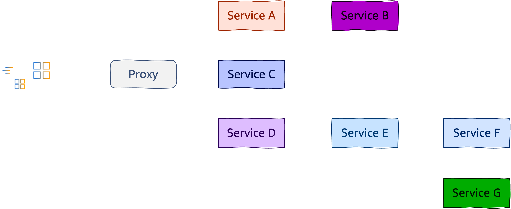

<!-- 로그와 메트릭 모두 최신 애플리케이션에서 한계가 있습니다.

1/ 둘 다 알려진 패턴으로 제한됩니다(모르는 경우 로그/메트릭이 없습니다).
2/ 로그는 일반적으로 PROD에서 다르게 구성됩니다(예: 오류만).
3/ 사용자 작업이 시스템에서 어떤 작업을 수행했는지 개요가 없습니다.

최신 observability는 unknown/unknown을 해결하려고 합니다.
-> 사후에 문제를 식별할 수 있는 능력을 기르는게 중요
-> 코드를 다시 배포하거나 변경하지 않고도 원인 파악을 하기 위해

많은 서비스가 상호 작용합니다. 종종 비동기식으로 통신도 합니다. 

이 그림에는 애플리케이션의 각 부분이 어떻게 서로 연관되어서 작동하는지는 알 수 있죠.
그러나 전체 소요시간에 대해서 알려주거나 여러가지 제약 사항들 (순서, 병렬 처리 등)에 대한 내용은 알 수 없습니다. -->


## Trace (Span)
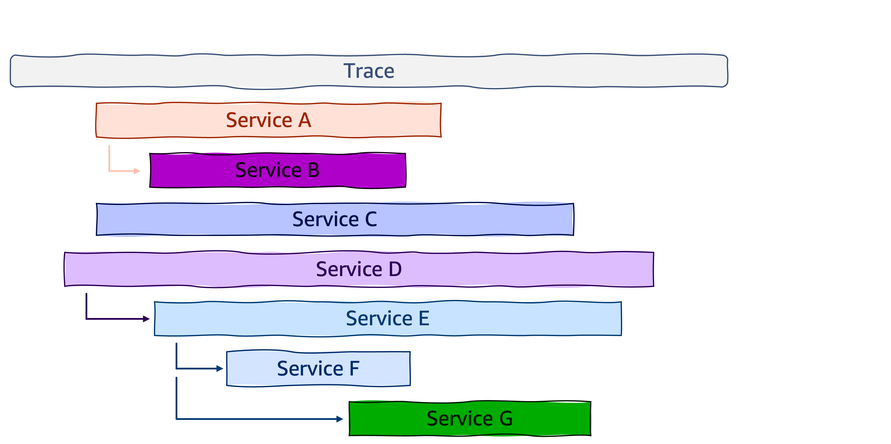

<!-- 이전 그림과 동일한 애플리케이션이지만 flow의 표현이 다릅니다.

하나의 루트 스팬이 있고 많은 자식 및 중첩된 자식 스팬이 보입니다.

다른점은 타임라인과 종속성에 대한 파악이 가능합니다.-->


## Trace - context propagation

#### W3C Trace Context :https://w3c.github.io/trace-context/

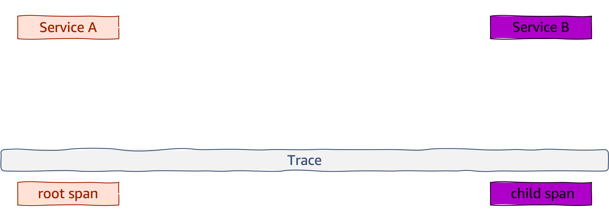


<!-- 이전 그림고 같이 관계/계층을 유지하려면 이 정보들을 전파(propagation)해야 합니다.

요즘은 HTTP 기반 통신을 사용하는 것이 문제되지 않습니다. 컨텍스트는 헤더를 사용하여 전파됩니다.

컨텍스트 전파(propagation)는 분산 추적을 가능하게 하는 핵심 개념입니다. 컨텍스트 전파를 사용하면 스팬이 생성된 위치와 상관없이 스팬을 서로 상호 연결시키고 조합할 수 있습니다. 

OpenTelemetry는 W3C 추적 컨텍스트 HTTP 헤더를 사용하여 원격 서비스에 컨텍스트를 전파하는 텍스트 기반 접근 방식을 제공합니다.

트레이스패런트 헤더는 버전-트레이스아이디-패런트아이디-트레이스플래그 형식을 사용합니다:
- 버전은 항상 00입니다.
- trace_id는 16진수로 인코딩된 trace ID입니다.
- span_id는 16진수로 인코딩된 스팬 ID입니다.
- trace_flags는 샘플링, trace level 등과 같은 trace 플래그를 포함하는 16비트 인코딩된 8비트 필드입니다.
-->


## Trace - context propagation
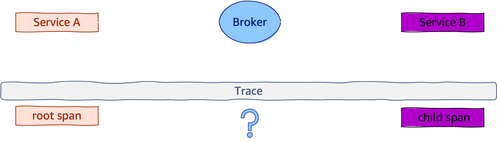


<!-- 여기서 챌린지는 뭘까요?

분산 시스템에서는 컨텍스트 전달하고 유지하는 것이 가장 큰 과제입니다.

기존 사용하던 도구가 otel이건, 데이터독이건 컨텍스트 전파를 지원하거나
또는 컨텍스트를 직접 만들어서 유지보수를 해야 합니다
-->

## Trace - context propagation
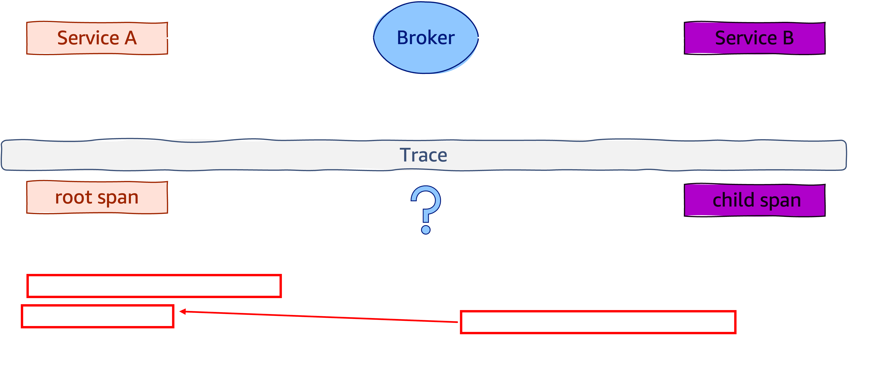

<!-- 그림을 보시면 루트 스팬과 하위 스팬 간의 관계를 확인할 수 있습니다.
- 부모 ID가 null인 경우 루트 스팬으로 식별되고, 루트 스팬id가 child span의 parent id로 전달이 잘 된다면 되겠죠? -->

## Trace - context propagation
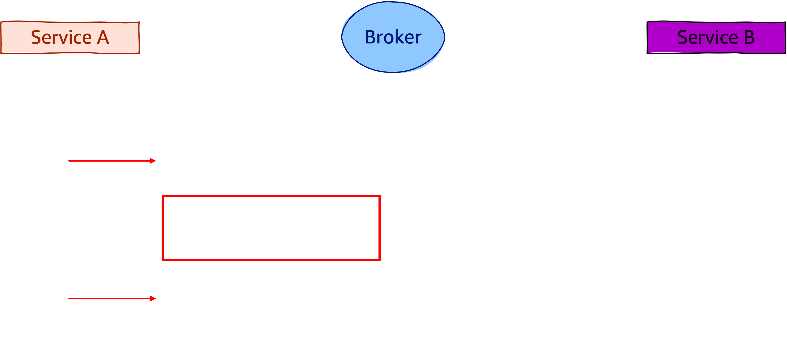

<!-- 
이벤트브리지나 메시지 브로커 또는 큐를 사용하는 분산 애플리케이션의 경우, 고객들이 특정 스키마 규칙을 채택하는 것을 확인할 수 있습니다 (그리고 이를 권장합니다).

하나의 JSON 객체를 전송하는 대신 컨텍스트별로 데이터를 분할해서 전달합니다.
1/ 페이로드 -> 데이터
2/ 런타임 정보 -> 메타데이터

그림에서는 “metadata”의 “otel” 속성에 있는 모든 trace 컨텍스트 정보를 전달합니다.
-->


## Trace - context propagation
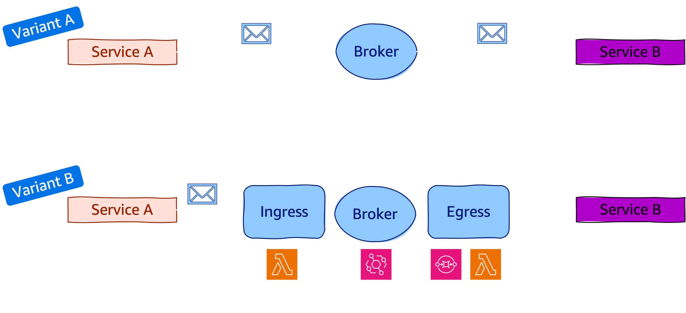

<!-- 변형된 아키텍처 A
프로듀서/컨슈머는 컨텍스트 유지에 대한 책임이 있습니다.
이것은 이전 그림에서 봤던 변형 아키텍처로, 모든 프로듀서는 데이터를 보강해야 하고 모든 컨슈머는 컨텍스트를 읽거나 복원해야 합니다.

이는 라이브러리를 사용하여 일반화할 수 있으며 일반적으로 그렇게 하고 있습니다. 책임은 여전히 프로듀서/컨슈머에게 있습니다.

변형아키텍처 B
컨텍스트 전파의 책임은 전용 시스템안에서 캡슐화됩니다.
서비스는 데이터를 인그레스(http 평문)로만 전송합니다.
이그레스는 헤더 표준화를 사용해서 컨슈머에게 이벤트를 보냅니다.  -->


## Span

<!-- 이제 트레이스가 무엇인지 알았으니 스팬에 대해 자세히 알아보겠습니다.

트레이스가 '전체 경로'의 '큰 그림'이라면 스팬은 그보다 작은 단위이며 작업의 단위를 나타냅니다.
이는 하나의 단위 비즈니스나 서비스를 나타내는 경우가 많습니다.

parent_id 가 없으니 이건 루트 스팬일거고, 
name, context, start_time/end_time도 볼 수 있지만 추가적인 두 가지 유용한 속성이 있습니다.

집계/필터/검색을 위해 사용자 정의 속성을 스팬에 저장하기 위해 키/밸류 형태로 속성을 저장하게 됩니다.

그리고 스팬이 생성되는 동안 이벤트를 알려줍니다. -->

```json
{
  "name": "/v1/sys/health",
  "context": {
    "trace_id": "7bba9f33312b3dbb8b2c2c62bb7abe2d",
    "span_id": "086e83747d0e381e"
  },
  "parent_id": "",
  "start_time": "2021-10-22 16:04:01.209458162 +0000 UTC",
  "end_time": "2021-10-22 16:04:01.209514132 +0000 UTC",
  "status_code": "STATUS_CODE_OK",
  "status_message": "",
  "attributes": {
    "http.scheme": "http",
    "http.host": "10.177.2.152:26040",
  },
  "events": [
    {
      "name": "",
      "message": "OK",
      "timestamp": "2021-10-22 16:04:01.209512872 +0000 UTC"
    }
  ]
}
```

## Span

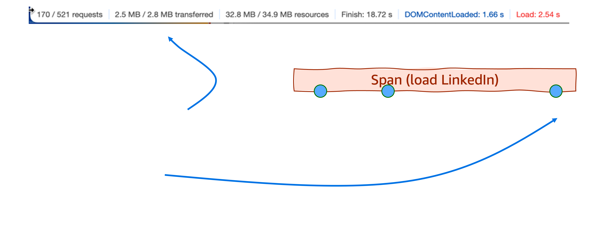

https://opentelemetry.io/docs/specs/otel/trace/exceptions/
<!--
타임라인의 특정 지점에서 3개의 전용 이벤트가 있는 페이지 로드(LinkedIn)의 예를 볼 수 있습니다.

스팬 속성과 스팬 이벤트 사이에는 몇 가지 중요한 차이점이 있습니다:
스팬 속성은 스팬을 쿼리하고 필터링하는 데 사용할 수 있습니다. 예를 들어 응답_크기 > 2MB인 모든 스팬을 표시합니다. 스팬 이벤트는 같은 방식으로 사용할 수 없습니다. 예를 들어 다음과 같은 쿼리는 불가능합니다. “SQS 대기열로 보낸 메시지”라는 이름의 이벤트가 있는 모든 스팬을 표시해 주세요.
스팬 속성은 시간 범위에 적용되는 반면, 스팬 이벤트는 특정 시점을 참조합니다.
스팬 속성은 대부분의 최신 observability 백엔드에서 무료로 제공되는 반면에, 스팬 이벤트는 개별 단위로 계산됩니다. 

이러한 속성 때문에 스팬 속성은 자유롭게 사용하고 스팬 이벤트는 아껴서 사용하는 것이 좋습니다.

항상 Exceptions를 스팬 이벤트로 보내야 합니다. 이것은 표준 OpenTelemetry 관행이며, 모든 OpenTelemetry SDK에서 기본적으로 지원됩니다. 예외 이벤트의 형식은 표준화되어 있으며, 인시던트가 발생할 때 이 데이터를 사용할 수 있으면 엄청난 이점을 얻을 수 있습니다.

많은 스팬 이벤트로 애플리케이션을 계측하되, 개발 목적으로만 사용하는 것을 고려하세요. 이는 프로덕션 환경에서 스팬 이벤트를 비활성화하거나 제거(예외 제외)하면 가능합니다.
-->

## Hello, OpenTelemetry

Open source project hosted on CNCF
Specifications, Implementations for instrumentation and transmissions of telemetry data (metrics, logs, traces)

1. Cross-language specifications

2. OpenTelemetry Collector (agent)

3. SDKs for each language

4. Auto Instrumentation

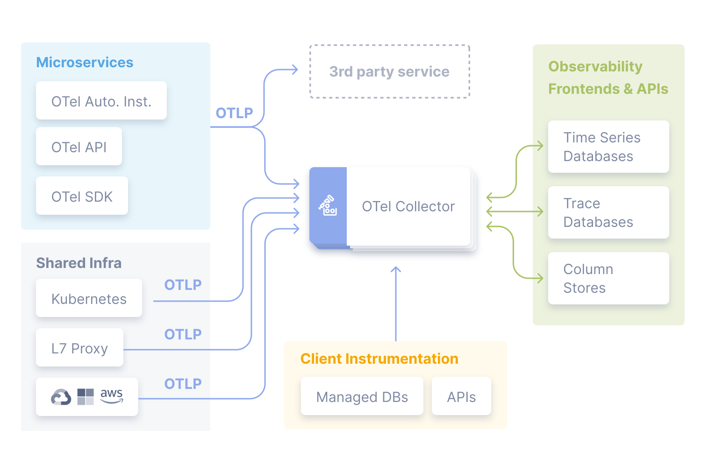

<!--  통합 observability 백엔드로 원격 분석(메트릭, 로그, 트레이스)데이터를 수집, 변환 및 전송하기 위한 표준화된 공급업체 독립적인 SDK, API 및 도구 세트입니다. 

유의해야할 점은 opentelemetry는 
- 트레이스 도구가 아니고
- 백엔드 스토리지 시스템도 아니고
- 시각화를 제공하는 도구도 아니다.
-->

## OpenTelemetry Instrumentation

1. Code-based solutions via [official APIs and SDKs](https://opentelemetry.io/docs/languages/) for most languages
    - `API` defines data types and how to generate telemetry data.
    - `SDK` defines a language-specific implementation of the API, plus configuration, data processing and exporting.
    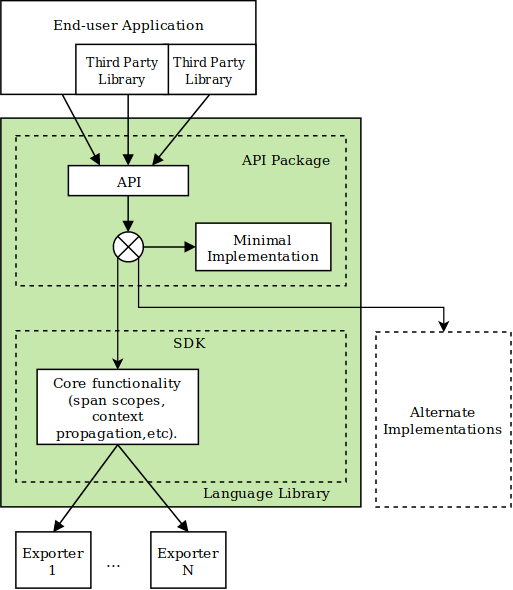

2. [Zero-code solutions](https://opentelemetry.io/docs/zero-code/)
    - [Go](https://opentelemetry.io/docs/zero-code/go/), [.NET](https://opentelemetry.io/docs/zero-code/net/), [PHP](https://opentelemetry.io/docs/zero-code/php/), [Python](https://opentelemetry.io/docs/zero-code/python/), [Java](https://opentelemetry.io/docs/zero-code/java/), [JavaScript](https://opentelemetry.io/docs/zero-code/js/)
<!-- 
대부분의 모든 언어를 제공하고 있고,

- API`는 데이터 유형과 텔레메트리 데이터를 생성하는 방법을 정의합니다.
- SDK`는 API의 언어별 구현과 구성, 데이터 처리 및 내보내기를 정의합니다. 

클라이언트 디자인 그림 설명
-->

## Manually Instrumentation (Python)

```python
@app.route("/server_request")
def server_request():
    with tracer.start_as_current_span(
        "server_request",
        context=extract(request.headers),
        kind=trace.SpanKind.SERVER,
        attributes=collect_request_attributes(request.environ),
    ):
        print(request.args.get("param"))
        return "served"
```

## Programmatically-instrumented server (Python)
```python
instrumentor = FlaskInstrumentor()

app = Flask(__name__)

instrumentor.instrument_app(app)
# instrumentor.instrument_app(app, excluded_urls="/server_request")
@app.route("/server_request")
def server_request():
    print(request.args.get("param"))
    return "served"

```


## OpenTelemetry Registry

OpenTelemetry instrumentation libraries

https://opentelemetry.io/ecosystem/registry/

### Search `NGINX`

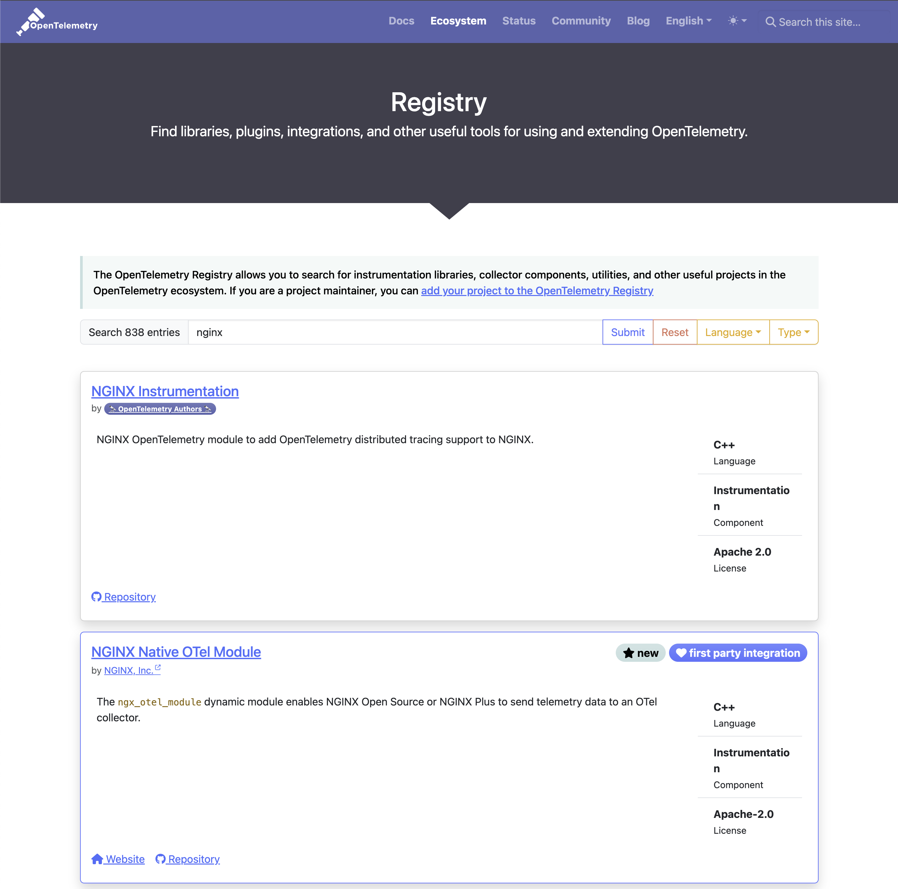

## OpenTelemetry collector


<!-- The Collector is a proxy that receives, processes and exports telemetry data in OTLP, Prometheus, and many proprietary tools. -->


## OpenTelemetry protocol (OTLP)

https://github.com/open-telemetry/opentelemetry-proto/blob/main/docs/specification.md

<!-- OTLP(오픈 텔레메트리 프로토콜) 사양은 텔레메트리 소스, 수집기, 텔레메트리 백엔드 등의 중간 노드 간의 텔레메트리 데이터 인코딩, 전송 및 전달 메커니즘을 설명합니다. -->

##### OTLP is implemented over `gRPC` and `HTTP` transports and specifies the Protocol Buffers schema used for payloads.

##### OTLP is a request/response style protocol where `clients` send requests and the `server` replies with corresponding responses.

##### All server components must support the following transport compression options: `none`, `gzip`


## Resource Semantic Conventions

##### A `Resource` represents the entity producing telemetry as resource attributes.
https://opentelemetry.io/docs/specs/semconv/

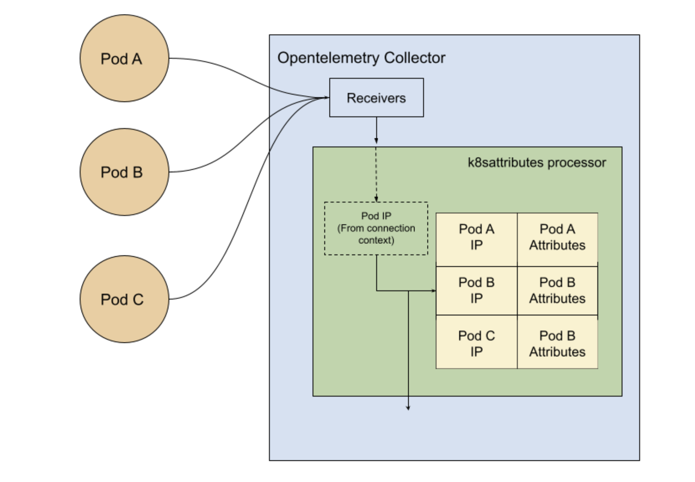
<!-- 리소스는 원격 분석을 생성하는 엔티티를 리소스 속성으로 나타냅니다. ㅇ
예시는 Kubernetes 객체와 메타데이터를 이해하는 데 유용한 리소스입니다: -->

## AWS Distro for OpenTelemetry (ADOT)

- Secure, production ready, and supported by AWS OpenTelemetry distribution	

-  Extend functionality for ease of use on AWS

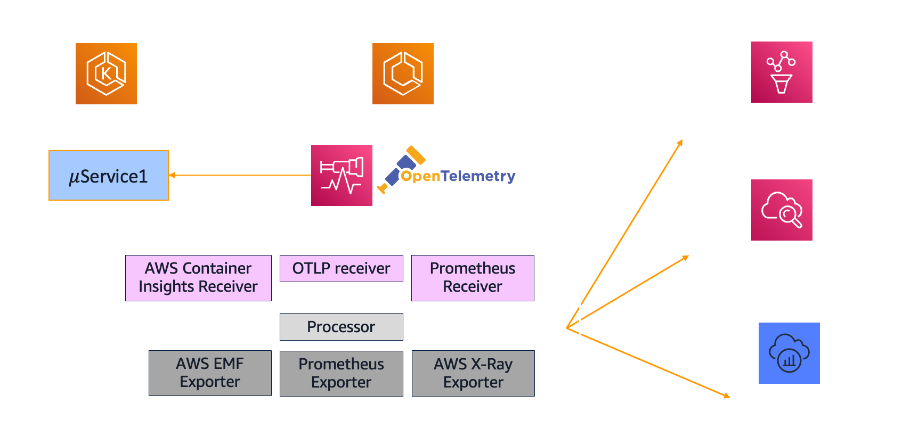

<!-- ADOT 수집기
사용자 환경에서 통합 가시성을 위해 ADOT를 사용하는 경우, 텔레메트리 데이터 수집은 ADOT 수집기를 사용하여 수행됩니다. ADOT 수집기는 텔레메트리 데이터를 수신, 처리 및 내보내는 방법에 대해 공급업체에 구애받지 않는 구현을 제공합니다. 따라서 하나 이상의 오픈 소스 또는 상용 백엔드로의 전송을 지원하기 위해 여러 개의 에이전트를 실행하고 유지 관리할 필요가 없습니다.
또한 수집기는 OpenTelemetry 계측 라이브러리 중 하나를 사용하는 경우 텔레메트리 데이터의 기본 위치이기도 합니다. -->

## AWS Distro for OpenTelemetry (ADOT)

<!-- ADOT를 사용하면 애플리케이션을 한 번 계측하고 연관된 로그, 메트릭, 추적을 Prometheus용 Amazon Managed Service, Amazon CloudWatch, AWS X-Ray, Amazon Open Search, 모든 OTLP(OpenTelemetry Protocol) 호환 백엔드, Apache Kafka용 Amazon Managed Streaming(MSK)과 같은 하나 이상의 가시성 백엔드로 전송할 수 있습니다: -->
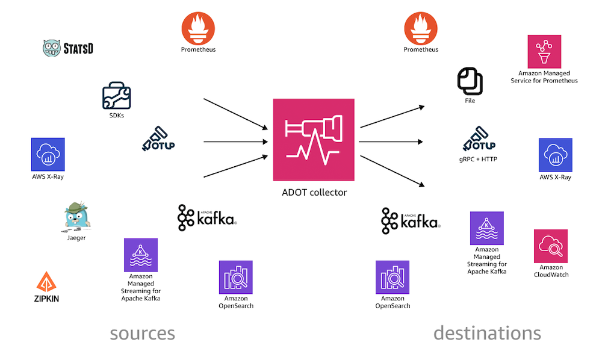

## OpenTelemetry Demo

[OpenTelemetry Demo](https://github.com/open-telemetry/opentelemetry-demo) is composed of microservices written in different programming languages that talk to each other over gRPC and HTTP; and a load generator which uses Locust to fake user traffic.

- [Web store](http://localhost:8080/)
- [Grafana](http://localhost:8080/grafana/)
- [Load Generator](http://localhost:8080/loadgen/)
- [Jaeger UI](http://localhost:8080/jaeger/ui/)

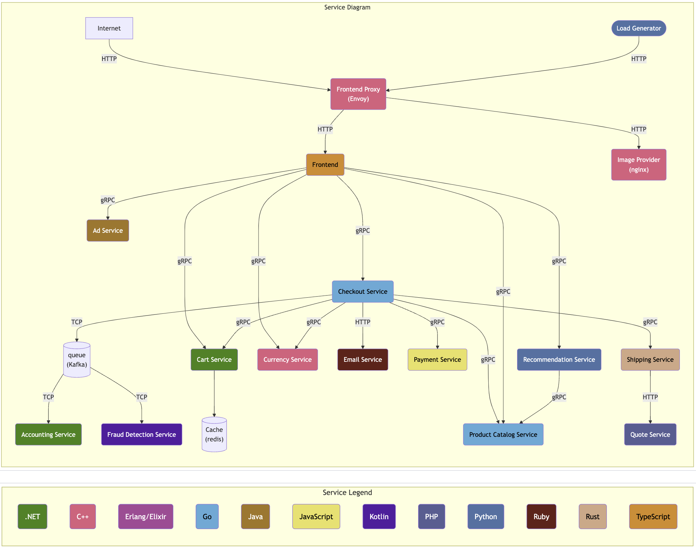

## New Otel Feature
Envoy and Istio
Profiling Agent
LLM Observability

## OpenTelemetry Collector Antipatterns


## References

- https://opentelemetry.io/docs/
- https://w3c.github.io/trace-context/
- https://w3c.github.io/baggage/
- https://github.com/open-telemetry/opentelemetry-specification
- https://opentelemetry.io/docs/specs/semconv/
- https://opentelemetry.io/docs/specs/otel/protocol/
- https://opentelemetry.io/docs/concepts/sampling/
- https://opentelemetry.io/docs/demo/
- https://opentelemetry.io/blog/2024/

# Thank You